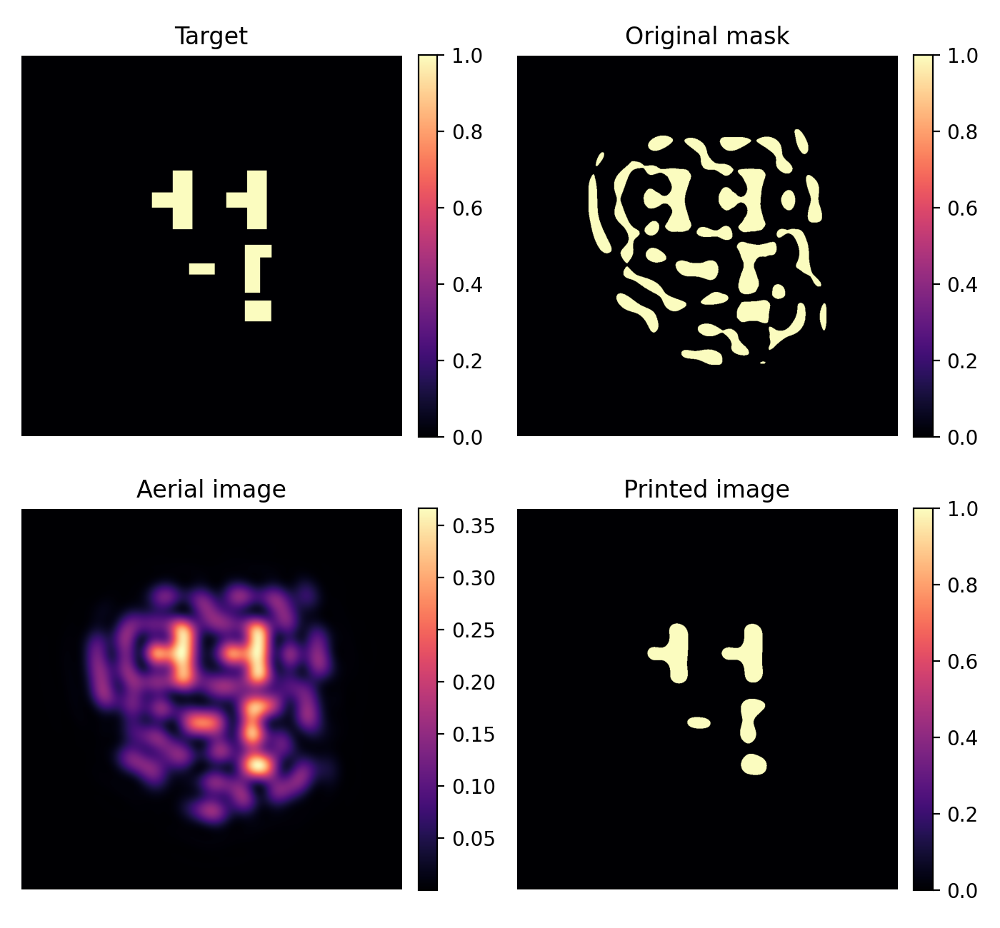
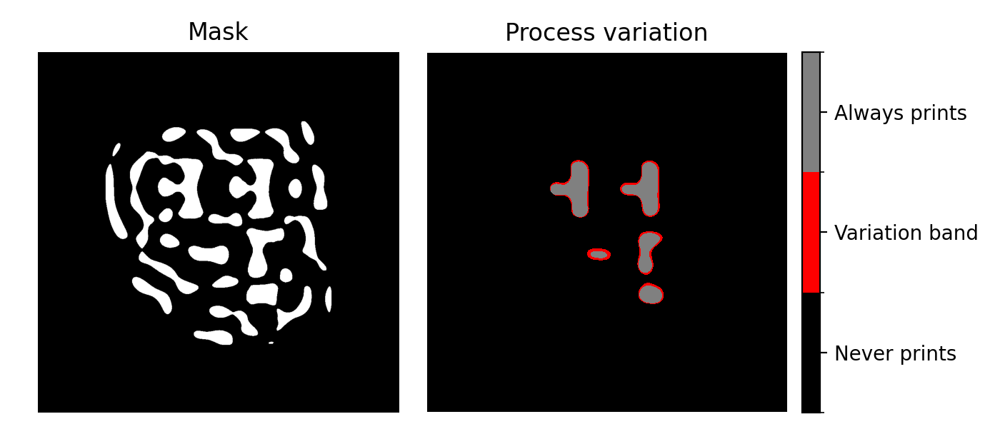

# 🔬 `lithox`

High-performance JAX-based photolithography simulation.

## Installation

```bash
pip install git+https://github.com/thomashirtz/lithox#egg=lithox
````

## Theory

`lithox` models partially coherent imaging via the Hopkins formulation with a coherent-mode decomposition. The formula used to compute the aerial image is:

$$
I(x,y)=\sum_{k} s_k \left|\big(h_k * (\mathrm{dose}\cdot M)\big)(x, y)\right|^{2},
$$

where $M$ is the mask, $h_k$ are coherent-mode PSFs, and $s_k\ge 0$ are the corresponding weights. In practice this is evaluated in the Fourier domain:

$$
I=\sum_{k} s_k \left| \mathcal{F}^{-1} \left(\mathcal{F}\\{\mathrm{dose}\cdot M\\}\cdot H_k\right)\right|^{2},
$$

with $H_k=\mathcal{F}\\{h_k\\}$.

A simple resist and print model maps the aerial image to binary output:

$$
R = \sigma \big(\alpha (I-\tau_{\mathrm{resist}})\big),\qquad
P = \mathbf{1} \left[R>\tau_{\mathrm{print}}\right].
$$

**Notations :**

* $x,y$: image-plane spatial coordinates.
* $M\in[0,1]^{H\times W}$: mask transmission.
* $\mathrm{dose}\in\mathbb{R}_+$: exposure dose scalar applied to the mask.
* $h_k$: $k$-th coherent-mode point spread function (PSF).
* $H_k$: Fourier transform of $h_k$.
* $s_k\ge 0$: nonnegative weight for mode $k$ (sums the partially coherent contributions).
* $*$: 2D convolution; $\mathcal{F}$, $\mathcal{F}^{-1}$: centered FFT and IFFT used in code.
* $I\in\mathbb{R}_+^{H\times W}$: aerial image (intensity).
* $\sigma(\cdot)$: logistic sigmoid; $\alpha>0$ is its steepness.
* $\tau_{\mathrm{resist}}$: threshold shifting the sigmoid; $R\in(0,1)^{H\times W}$ is the “resist” image.
* $\tau_{\mathrm{print}}$: binarization threshold; $P\in\\{0,1\\}^{H\times W}$ is the final printed pattern.

Gradients are supported via a custom VJP for the aerial step, enabling end-to-end autodiff through $I\rightarrow R\rightarrow P$ (with a straight-through style threshold in practice).

> The coherent-mode kernels and weights used by lithox are taken from the [lithobench](https://github.com/shelljane/lithobench) project and redistributed here for convenience.

## Simulation

Getting started:

```python
import lithox as ltx
import matplotlib.pyplot as plt

mask = ltx.load_image("./data/mask.png", size=1024) # Update the path if necessary

simulator = ltx.LithographySimulator()
output = simulator(mask)

plt.imshow(output.printed)
plt.show()
```

**What does `output` contain ?**

* `output.aerial: jnp.Array` — continuous aerial intensity $I$ (float32, shape `[H, W]`).
* `output.resist: jnp.Array` — sigmoid-mapped resist image $R\in(0,1)$ (float32, `[H, W]`).
* `output.printed: jnp.Array` — binary print $P\in\\{0,1\\}$ (float32, `[H, W]`).

`LithographySimulator` variants (identical API, different conditions):

* `LithographySimulator.nominal(...)`: in-focus kernels, nominal dose.
* `LithographySimulator.maximum(...)`: in-focus kernels, maximum dose.
* `LithographySimulator.minimum(...)`: defocus kernels, minimum dose.

<p align="center">
  
</p>
<p align="center">
  <em>Example of simulation output generated with the script <code><a href="./scripts/simulation.py">./scripts/simulation.py</a></code></em>
</p>

<details>
 
<summary>More detailed example:</summary>
 
```python
import lithox as ltx
import matplotlib.pyplot as plt

mask = ltx.load_image("./data/mask.png", size=1024) # Update the path if necessary

simulator = ltx.LithographySimulator()
output = simulator(mask)

title_to_data = {
    "Mask": mask,
    "Aerial image": output.aerial,
    "Resist image": output.resist,
    "Printed image": output.printed,
}

fig, axes = plt.subplots(2, 2, constrained_layout=True)
for ax, (title, data) in zip(axes.flat, title_to_data.items()):
    ax.imshow(data, cmap="gray")
    ax.set_title(title, pad=2)
    ax.axis("off")

plt.show()
```
 
</details>

## Process variation

`ProcessVariationSimulator` bundles three simulators to emulate process corners:

* **nominal** — in-focus, nominal dose
* **max** — in-focus, maximum dose
* **min** — defocus, minimum dose

Calling it returns all three results in a structured output so you can compare aerial/resist/printed across corners.

```python
from lithox.variation import ProcessVariationSimulator

pvs = ProcessVariationSimulator()
pv_output = pvs(mask)

# Access by field:
I_nom, I_max, I_min = pv_output.aerial.nominal, pv_output.aerial.max, pv_output.aerial.min
R_nom, R_max, R_min = pv_output.resist.nominal, pv_output.resist.max, pv_output.resist.min
P_nom, P_max, P_min = pv_output.printed.nominal, pv_output.printed.max, pv_output.printed.min
```

**Process-variation band (PVB)**
A simple stability indicator is the fraction of pixels that flip across corners:

$$
\mathrm{PVB\_mean}=\frac{1}{HW}\sum_{x,y}\big(P_{\max}(x,y)-P_{\min}(x,y)\big).
$$

`get_pvb(mask)` computes exactly that mean fraction:

```python
pvb_mean = pvs.get_pvb(mask)  # scalar in [0,1]
print(float(pvb_mean))  # e.g., 0.07 means 7% of pixels are unstable
```

If you also want the *map* of unstable pixels (0/1 per pixel), you can derive it from `pv_output`:

```python
import jax.numpy as jnp

pv_map = (pv_output.printed.max - pv_output.printed.min).astype(jnp.float32)  # [H, W]
```

<p align="center">
  
</p>
<p align="center">
  <em>Example of process variation band computed using the script <code><a href="./scripts/variation.py">./scripts/variation.py</a></code></em>
</p>

## Citation

If you use lithox in your work—whether for research, publications, or projects—please cite it as follows:

```bibtex
@misc{hirtz2025lithox,
  author       = {Thomas Hirtz},
  title        = {lithox: A JAX-based lithography simulation library},
  year         = {2025},
  howpublished = {\url{https://github.com/thomashirtz/lithox}},
  publisher    = {GitHub},
}
```
