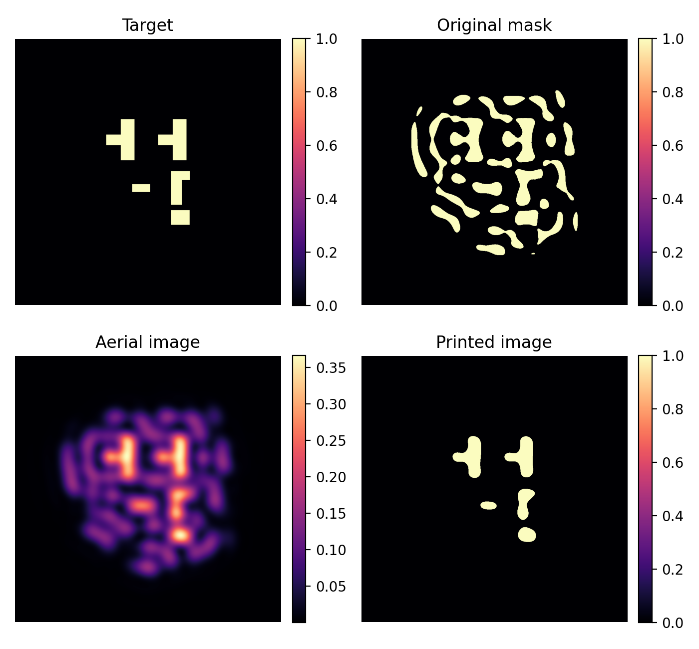
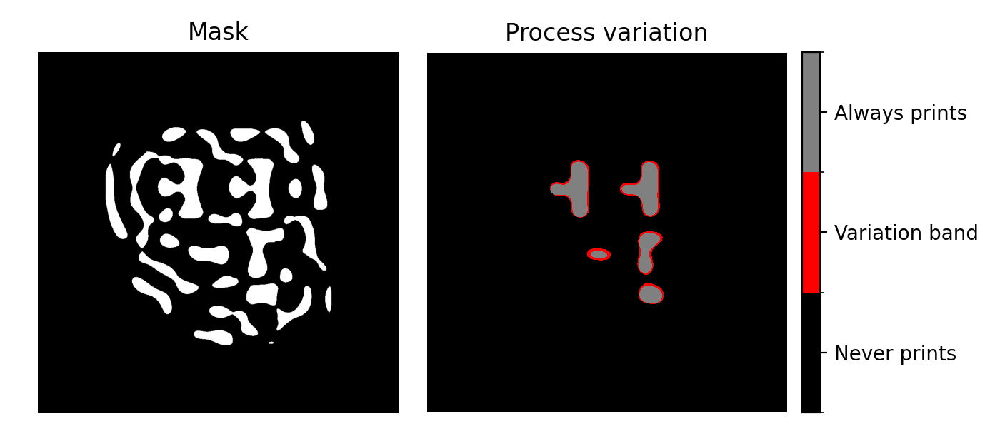

# 🔬 `lithox`

High-performance JAX-based photolithography simulation.

## Installation

```bash
pip install git+https://github.com/thomashirtz/lithox#egg=lithox
```

For local development (tests, plotting, URL image loading, ...):

```bash
pip install -e ".[dev]"
```

**Dependencies:** `jax>=0.8.0` (tested with 0.10.1; avoid 0.7.0–0.7.1 with Equinox). Bundled Hopkins kernels are stored as static Equinox fields so they are not traced during `jit` / `grad`.

## Theory

`lithox` models partially coherent imaging via the Hopkins formulation with a coherent-mode decomposition. The formula used to compute the aerial image is:

$$
I(x,y)=\sum_{k} s_k \left|\big(h_k * (\mathrm{dose}\cdot M)\big)(x, y)\right|^{2},
$$

where $M$ is the mask, $h_k$ are coherent-mode PSFs, and $s_k\ge 0$ are the corresponding weights. In practice this is evaluated in the Fourier domain:

$$
I=\sum_{k} s_k \left| \mathcal{F}^{-1} \left(\mathcal{F}\\{\mathrm{dose}\cdot M\\}\cdot H_k\right)\right|^{2},
$$

with $H_k=\mathcal{F}\\{h_k\\}$.

Compact resist model (MOSAIC, Neural-ILT): a **sigmoid on aerial intensity** for differentiation, and a **binary threshold on resist** for physical print:

$$
R = \sigma \big(\alpha (I-\tau)\big),\qquad
P = \mathbf{1} \left[R>0.5\right].
$$

For mask optimization, use $R$ in the loss, or use straight-through binarization via `output.printed_ste`.

**Notations:**

* $x,y$: image-plane spatial coordinates.
* $M\in[0,1]^{H\times W}$: mask transmission.
* $\mathrm{dose}\in\mathbb{R}_+$: exposure dose scalar applied to the mask.
* $h_k$: $k$-th coherent-mode point spread function (PSF).
* $H_k$: Fourier transform of $h_k$.
* $s_k\ge 0$: nonnegative weight for mode $k$ (sums the partially coherent contributions).
* $*$: 2D convolution; $\mathcal{F}$, $\mathcal{F}^{-1}$: centered FFT and IFFT used in code.
* $I\in\mathbb{R}_+^{H\times W}$: aerial image (intensity).
* $\sigma(\cdot)$: logistic sigmoid.
* $\alpha>0$: sigmoid steepness (`resist_steepness`, default 50).
* $\tau$: intensity threshold on $I$ (`resist_threshold`, default 0.225).
* $R\in(0,1)^{H\times W}$: resist activation (`output.resist`; papers often call this $Z$).
* $P$: binary print (`output.printed`).

Gradients: custom VJP on the aerial step; sigmoid on $I$; optional STE on binarization (`output.printed_ste`).

> The coherent-mode kernels and weights used by lithox are taken from the [lithobench](https://github.com/shelljane/lithobench) project and redistributed here for convenience.

## Simulation

Mask images must be at least **35×35** pixels (last two axes). That limit comes from the bundled LithoBench coherent-mode kernels (35×35 in Fourier space).

Getting started:

```python
import lithox as ltx
import matplotlib.pyplot as plt

mask = ltx.load_image("./data/mask.png", size=1024)

simulator = ltx.LithographySimulator()
output = simulator(mask)

plt.imshow(output.printed)
plt.show()
```

**What does `output` contain?**

* `output.aerial: jnp.Array` — continuous aerial intensity $I$ (float32, shape `[H, W]`).
* `output.resist: jnp.Array` — resist activation $R\in(0,1)$ (float32, `[H, W]`).
* `output.printed: jnp.Array` — hard print $P=\mathbf{1}[R>0.5]$ (float32 in `{0,1}`, `[H, W]`).
* `output.printed_ste: jnp.Array` — same binary forward as `printed`, but gradients flow through $R$ (STE).

`LithographySimulator` variants (identical API, different conditions):

* `LithographySimulator.nominal(...)`: in-focus kernels, nominal dose.
* `LithographySimulator.maximum(...)`: in-focus kernels, maximum dose.
* `LithographySimulator.minimum(...)`: defocus kernels, minimum dose.

<p align="center">
  
</p>
<p align="center">
  <em>Example of simulation output generated with the script <code><a href="./scripts/simulation.py">./scripts/simulation.py</a></code></em>
</p>

<details>
 
<summary>More detailed example</summary>
 
```python
import lithox as ltx
import matplotlib.pyplot as plt

mask = ltx.load_image("./data/mask.png", size=1024)

simulator = ltx.LithographySimulator()
output = simulator(mask)

title_to_data = {
    "Mask": mask,
    "Aerial image": output.aerial,
    "Resist image": output.resist,
    "Printed image": output.printed,
}

fig, axes = plt.subplots(2, 2, constrained_layout=True)
for ax, (title, data) in zip(axes.flat, title_to_data.items()):
    ax.imshow(data, cmap="gray")
    ax.set_title(title, pad=2)
    ax.axis("off")

plt.show()
```
 
</details>

## Process variation

`ProcessVariationSimulator` bundles three simulators to emulate process corners:

* **nominal** — in-focus, nominal dose
* **max** — in-focus, maximum dose
* **min** — defocus, minimum dose

Calling it returns all three results in a structured output so you can compare aerial/resist/printed across corners.

```python
import lithox as ltx

pvs = ltx.ProcessVariationSimulator()
pv_output = pvs(mask)

# Access by field:
I_nom, I_max, I_min = pv_output.aerial.nominal, pv_output.aerial.max, pv_output.aerial.min
R_nom, R_max, R_min = pv_output.resist.nominal, pv_output.resist.max, pv_output.resist.min
P_nom, P_max, P_min = pv_output.printed.nominal, pv_output.printed.max, pv_output.printed.min
```

**Process-variation band (PVB)** — from the same `pv_output` (no extra simulation):

* **Metric** (binary): `pv_output.pvb_map`, `pv_output.pvb_mean` — $P_{\max} - P_{\min}$
* **Loss** (differentiable): `pv_output.pvb_loss_map`, `pv_output.pvb_loss_mean` — $R_{\max} - R_{\min}$

```python
pv_output = pvs(mask)
pvb_map = pv_output.pvb_map
pvb_loss_map = pv_output.pvb_loss_map
```

<p align="center">
  
</p>
<p align="center">
  <em>Example of process variation band computed using the script <code><a href="./scripts/variation.py">./scripts/variation.py</a></code></em>
</p>

## Citation

If you use lithox in your work—whether for research, publications, or projects—please cite it as follows:

```bibtex
@misc{hirtz2025lithox,
  author       = {Thomas Hirtz},
  title        = {lithox: A JAX-based photolithography simulation library},
  year         = {2025},
  howpublished = {\url{https://github.com/thomashirtz/lithox}},
  publisher    = {GitHub},
}
```
